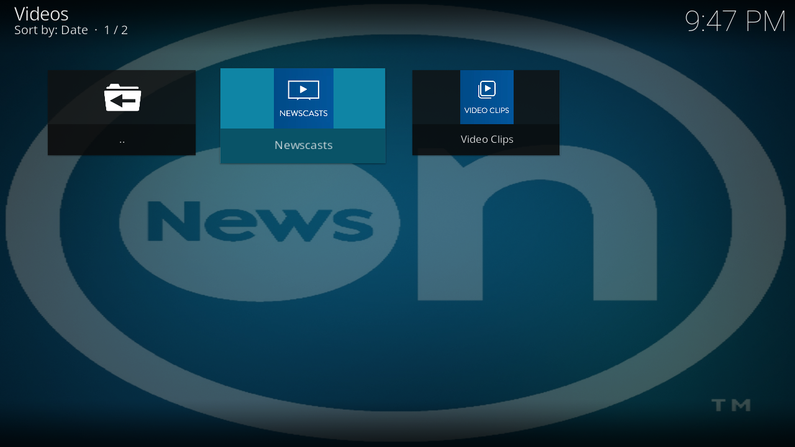
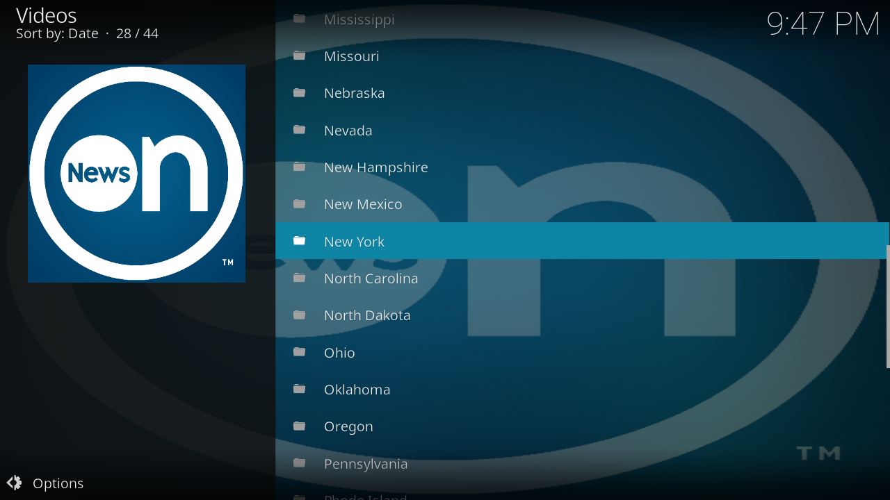
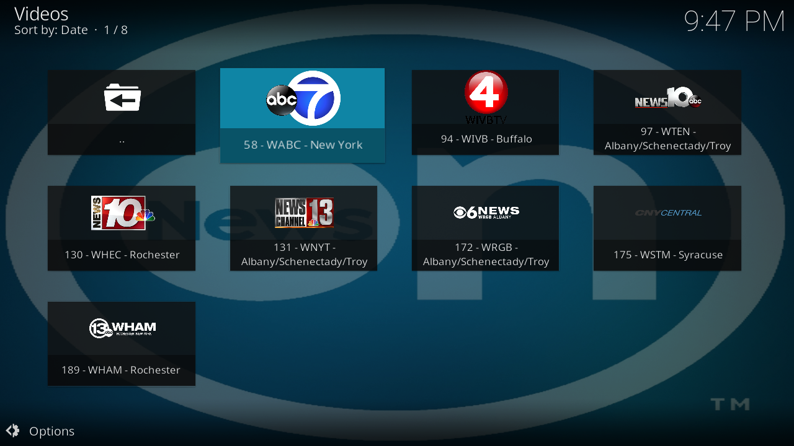
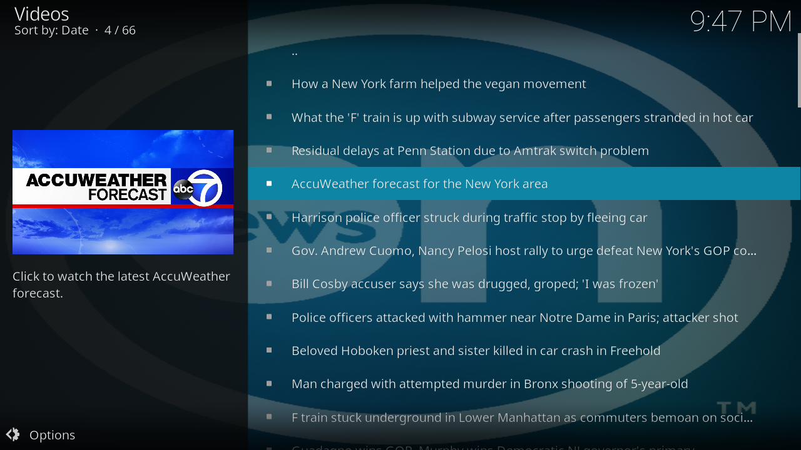

# NewsON for Kodi

**Local News Nationwide - Watch live local news from over 175 stations across the United States**

## About This Project

This addon was originally created by Lunatixz but became deprecated when NewsON changed their API infrastructure. I've completely revived and modernized it, migrating from the old v1.3.3 API to the new v5 API, implementing a universal content parser, and adding extensive new features.

NewsON provides instant access to live or on-demand broadcasts from local stations in 114 U.S. markets. Access previous newscasts for up to 48 hours after they air, browse by state and city, search for specific content, and watch live streams without a cable subscription or login.

## Features

### Main Menu
- **Live Now** - Current live broadcasts from local stations
- **Breaking News** - Latest breaking news coverage
- **What's On** - Featured content and highlights
- **Sports** - Sports news and coverage from local teams
- **Browse Stations** - Browse by state and city
- **Search Stations** - Find stations with full search history
- **Search Clips/Shows** - Search for specific news clips and shows

### Key Features
- Live streaming from 175+ local news stations
- On-demand access to recent newscasts (up to 48 hours)
- Comprehensive search functionality with history management
- Sports content from local teams
- Station browsing by state and city
- Direct video playback with HLS stream support
- Context menus for quick station access
- No cable subscription or login required

## What's New in v2.1.0

### Major Improvements
- **Universal Content Parser** - Dynamically handles all v5 API content types
- **Search System** - Full search functionality for both stations and clips/shows with persistent history
- **Sports Integration** - Browse sports shows, teams, and content
- **Enhanced Navigation** - Improved menu structure and content organization
- **Bug Fixes** - Resolved URL encoding issues, routing errors, and duplicate dialogs

See [CHANGELOG.md](CHANGELOG.md) for complete version history.

## Installation

### Method 1: From Repository (Recommended)
1. Download the repository ZIP file
2. In Kodi, go to Settings > Add-ons > Install from zip file
3. Select the repository ZIP file
4. Go to Install from repository > [Your Repository Name]
5. Select Video add-ons > NewsON > Install

### Method 2: Manual Installation
1. Download the latest release ZIP file
2. In Kodi, go to Settings > Add-ons > Install from zip file
3. Navigate to the downloaded ZIP file and select it
4. Wait for the "Add-on enabled" notification

## Requirements

- Kodi 19 (Matrix) or higher
- Internet connection
- Dependencies (automatically installed):
  - xbmc.python (3.0.0+)
  - script.module.six
  - script.module.kodi-six
  - script.module.simplecache
  - script.module.routing

## Technical Highlights

### API Migration
Completely migrated from the deprecated v1.3.3 API to the modern v5 API:
- Old: `https://newson.us/api/`
- New: `https://newson-api.triple-it.nl/v5api/`

### Custom HTTP Client
Replaced the heavy `requests` module with a custom lightweight client:
- Built-in Cloudflare and DDoS-Guard protection
- Session management and cookie persistence
- Better SSL/TLS handling
- Reduced dependencies and improved performance

### Universal Parser System
Built a dynamic content parser that handles all v5 API content types:
- VOD rows and station rows
- Sports content and team organization
- Breaking news and featured content
- Automatic content type detection

## Screenshots

## Usage

1. Launch the NewsON addon from Kodi's Video Add-ons section
2. Choose from the main menu options:
   - Browse live content or breaking news
   - Search for specific stations or clips
   - Browse stations by state and city
   - Watch sports content
3. Select a video to play
4. Use context menus (right-click/long-press) for additional options

## Known Limitations

- Breaking news endpoint may return empty results depending on NewsON's feed
- Some VOD content may not have playback URLs immediately available
- Geolocation is determined by NewsON's API (not user-configurable)

## Support

If you encounter issues:
1. Enable debug mode in addon settings
2. Check the Kodi log file
3. Create an issue on GitHub with:
   - Kodi version
   - Addon version
   - Steps to reproduce
   - Relevant log entries

## Contributing

Contributions are welcome! Please feel free to submit pull requests or open issues for bugs and feature requests.

## Credits

- **Original Author**: Lunatixz
- **Revival & Modernization**: [Your GitHub Username]
- **Service Provider**: NewsON (newson.us)

## License

This project is licensed under the GPL-3.0-or-later License - see the [LICENSE](LICENSE) file for details.

## Changelog

See [CHANGELOG.md](CHANGELOG.md) for a complete list of changes and version history.

---

**Disclaimer**: This is an unofficial addon for the NewsON service. All content is provided by NewsON and their partner stations. This addon simply provides a convenient interface to access their publicly available content through Kodi.